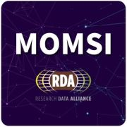
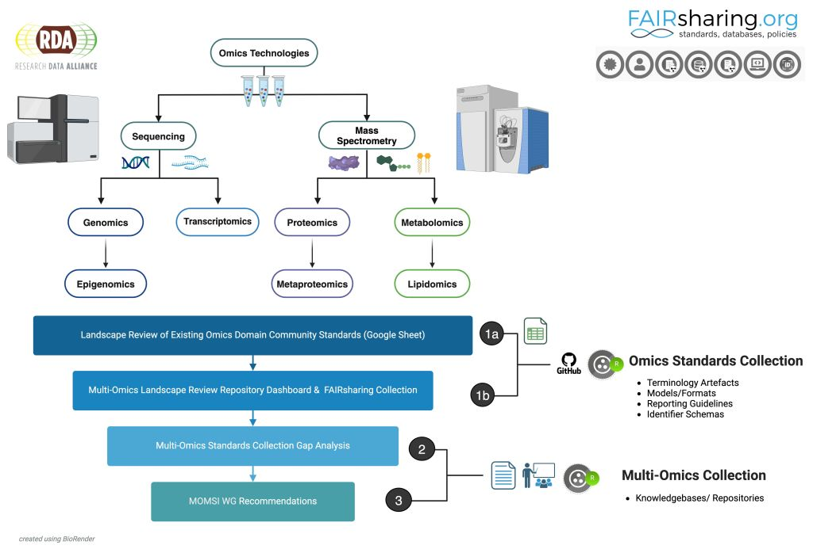

---

Welcome to the [Multi-Omics Metadata Standards Integration (MOMSI) Working Group](https://www.rd-alliance.org/groups/multi-omics-metadata-standards-integration-momsi-wg) community-driven Multi-Omics standard landscape review curation workflow and interactive web-based dashboard tool. Explore >240 standards from our Omics Landscape Review (Deliverable 1a) repository containing Multi-omics domain (genomics, proteomics, metabolomics, lipidomics, etc.) and universal (generalist) standards curated by the MOMSI WG. 

### 🎯 Scope

This resource contains an iterative list of curated controlled vocabularies/ontologies, metadata reporting guidelines, data models/formats, and identifier schemas relevant to Omics application technologies and FAIR best practices. This platform is designed to support continuous curation of Omics domain and generalist community-accepted standards in real time aiding next-generation Multi-Omics data integration platform system developments, refinements, and new implementations.

### 📥 Usage

This resource supports users interested in Multi-omics data and metadata standards integration across MOMSI subject areas in Genomics, Proteomics, Metabolomics, and Lipidomics domain class and subclasses corresponding to application technologies in sequencing and mass spectrometry.

**Target Users:**
 - Researchers (data and metadata generators/stewards)
 - Data Support Professionals (data managers/project managers)
 - Developers (data and metadata consumers/generators/standard creators)
 - Data Curators (data quality assurance assessors)
 - Data Publishers (service providers)

> ℹ️ Not sure where to begin?
> - Visit our [Glossary](src/glossary.md) page to browse curated concept and terminologies linked to filter tags listed at the dashboard and FAIRsharing Collection.
> - Visit our [User Journeys](src/user-journeys.md) page for themed use-case exploration of standard types, data lifecycle curation concepts, and core Omics subject areas.

---
## Contributing

Community contributions are welcome and encouraged! Contribution guidelines for new record requests, edits, and/or other source code updates are available at the [CONTRIBUTING](CONTRIBUTING.md) page. 

#### 🙌 CRediT

As part of the MOMSI WG sustainability workflow, supporting community best practices and transparency, all dashboard community contributions are captured using the [CRediT Taxonomy Roles](https://doi.org/10.25504/FAIRsharing.fe4816) standard terminology and [ORCID](https://doi.org/10.25504/FAIRsharing.OrNi1L) identifiers. 

#### 📮 Feedback

To provide comments or feedback on your user dashboard navigation experience, please visit the [MOMSI WG Landscape Review Dashboard Feedback Form](https://forms.gle/uyovpTRTMpYbvoV57).

---

## ⚖️ Governance

This repository is maintained by the MOMSI WG co-chairs. Co-chair duties include quality review of curated standards prior to merge and standard additions to the FAIRsharing Collection as record owners.

### ♻️ Sustainability

As part of our sustainability workflow and long-term maintenance plan this repository was established to provide a transparent method for sharing expert-level information with non-expert users. Expert curated Multi-Omics standards, originally captured in a Google Sheet, now available in a machine-actionable and version controlled environment, enables open-access to live curated WG deliverables for continuous update by the scientific community as future standards evolve. This repository serves as the first step in our sustainability workflow process for downstream inclusion at our [MOMSI FAIRsharing Standard Collection (Deliverable 1b)](https://fairsharing.org/5742), in collaboration with the RDA FAIRsharing WG.

---

## ⚙️ Maintenance

####  ✅ Updates

The dashboard is automatically rebuilt on any repository changes using scheduled workflows in GitHub Actions.

---

## 🌟 Attribution

### ©️ Copyrights & Licensing

Copyright 2023–2025 RDA Multi-Omics Metadata Standards Integration Working Group.

The code in this repository is licensed under the [BSD-3-Clause License](https://github.com/RDA-MOMSI/Dashboard#BSD-3-Clause-1-ov-file).

> 🔥 📖 **Citation Policy**
>_ In efforts to enable discovery, sharing, and reuse of RDA WG deliverables, we kindly ask the MOMSI WG Landscape Review Dashboard Repository and provided supporting materials be referenced under the following citations._
>1. source code doi placeholder
>2. journal article doi placeholder

### 🎁 Funding

A portion of this work was funded under the European Union's Horizon Europe Framework Programme under the project grant agreement No. 101094406. Views and opinions expressed are however those of the author(s) only and do not necessarily reflect those of the European Union or the European Research Executive Agency. Neither the European Union nor the granting authority can be held responsible for them.

### 🙌 Acknowledgements

We thank [Whythawk](https://whythawk.com/) for contributions on repository infrastructure developments and interactive web-based dashboard implementations.