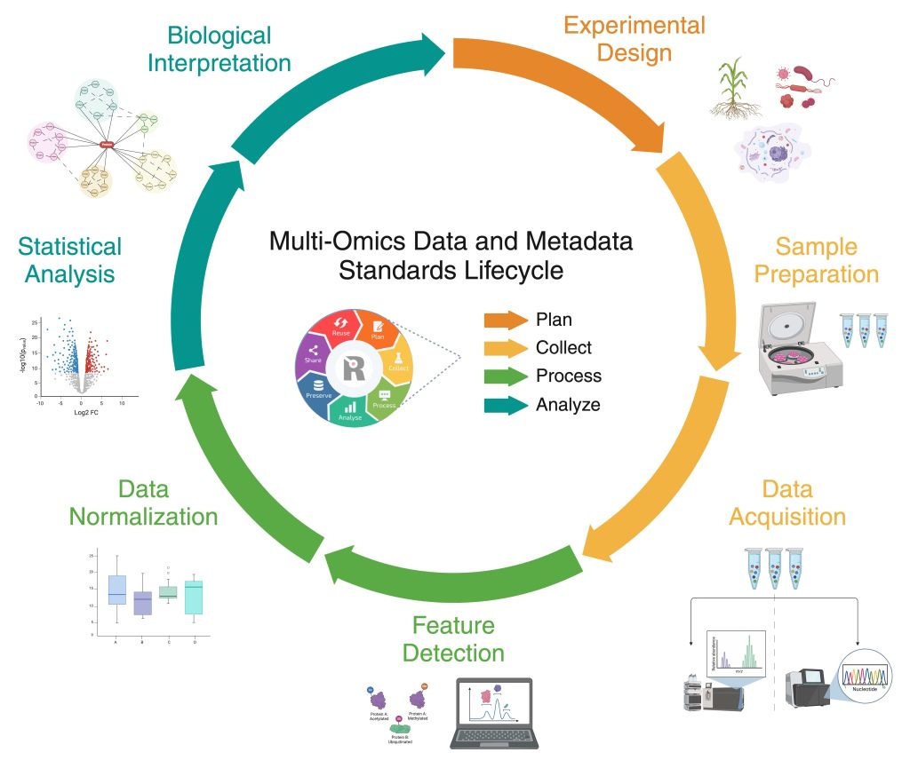

# User Journeys

MOMSI user journeys provide unique educational examples for assisting users with navigation and exploration between deliverables. Journeys explore curation activity themes covering MOMSI concepts curated in our landscape review expanding on the RDMkit research data lifecycle framework and subject domain research area terms linked to FAIRsharing standards types at our collection.

---

## MOMSI Research Data Lifecycle Journeys

The [Research Data Management toolkit for Life Sciences (RDMkit)](https://rdmkit.elixir-europe.org/) is just one of many global community resources supporting educational awareness around core data management concepts and best practices for proper handling of digital data at each stage of the research [data life cycle](https://rdmkit.elixir-europe.org/data_life_cycle). The MOMSI landscape review dashboard curation workflow includes leveraging key concepts from RDMkit (Figure 1)and expands on this work to capture how each domain or generalist standard aligns to the research data lifecycle (where applicable). Capturing domain use-case research data lifecycle curations, as part of our curation criteria, is aimed to provide expert level (domain-informed) recommendation resources for non-expert professionals tasked with data management planning and forecasting tasks.

> <svg xmlns="http://www.w3.org/2000/svg" width="20" height="20" viewBox="0 0 24 24" fill="none" stroke="currentColor" stroke-width="2" stroke-linecap="round" stroke-linejoin="round"><path d="M8.5 14.5A2.5 2.5 0 0 0 11 12c0-1.38-.5-2-1-3-1.072-2.143-.224-4.054 2-6 .5 2.5 2 4.9 4 6.5 2 1.6 3 3.5 3 5.5a7 7 0 1 1-14 0c0-1.153.433-2.294 1-3a2.5 2.5 0 0 0 2.5 2.5z"/></svg> Collaboration Highlight: RDA Life Science Data Infrastructures IG
>  - Mutual global co-chair alignments aimed to enhance data management best practices and stewardship standard-informed decision making improving metadata harmonization for data integration.

### Browse Standard Implementations by Lifecycle Stage

1. [Planning](glossary/Planning) use-case planning considerations for standard ontology selection while drafting a data management plan [here](https://rdmkit.elixir-europe.org/metadata_management#how-do-you-find-appropriate-vocabularies-or-ontologies)
2. [Collecting](glossary/Collecting) use-case collection considerations for metagenomics [here](https://rdmkit.elixir-europe.org/marine_metagenomics#managing-marine-metagenomic-metadata)
3. [Processing](glossary/Processing) use-case processing considerations for proteomics [here](https://rdmkit.elixir-europe.org/proteomics#processing-and-analysis-of-proteomics-data)
4. [Analyzing](glossary/Analyzing) use-case analysis considerations for single-cell sequencing [here](https://rdmkit.elixir-europe.org/single_cell_sequencing#data-analysis-steps-and-related-format-for-single-cell-sequencing)
5. [Preserving](glossary/Preserving) use-case preservation considerations for publishing expression data [here](https://rdmkit.elixir-europe.org/single_cell_sequencing#long-term-data-storage-and-accessibility)
6. [Sharing](glossary/Sharing) use-case sharing considerations for genomics [here](https://rdmkit.elixir-europe.org/human_pathogen_genomics#sharing-and-preserving-pathogen-genomic-data)
7. [Reusing](glossary/Reusing) use-case reuse considerations for persistent identifier selection [here](https://rdmkit.elixir-europe.org/identifiers#which-type-of-identifiers-should-you-use-for-data-publication)

---

## MOMSI FAIRsharing Collection Journeys

The [MOMSI FAIRsharing Standard Collection (Deliverable 1b)](https://fairsharing.org/5742) is a refined and filtered down collection of domain specific and Omics relevant universal terminologies, metadata reporting guidelines, data models/formats, and identifier schemas. New and existing standards listed in this collection have undergone an iterative in-depth landscape review process using the MOMSI curation dashboard sustainability workflow.

New and existing standards listed in this collection have undergone an iterative in-depth landscape review process using the MOMSI curation dashboard sustainability workflow. This process involves evaluating the accuracy and completeness of each standard and the minimal information criteria required for curation. Our collection seeks to benefit and encourage continuous, open, and machine-actionable Multi-omics community standards curation, supporting evolving research data management and sharing best practices.

> <svg xmlns="http://www.w3.org/2000/svg" width="20" height="20" viewBox="0 0 24 24" fill="none" stroke="currentColor" stroke-width="2" stroke-linecap="round" stroke-linejoin="round"><path d="M8.5 14.5A2.5 2.5 0 0 0 11 12c0-1.38-.5-2-1-3-1.072-2.143-.224-4.054 2-6 .5 2.5 2 4.9 4 6.5 2 1.6 3 3.5 3 5.5a7 7 0 1 1-14 0c0-1.153.433-2.294 1-3a2.5 2.5 0 0 0 2.5 2.5z"/></svg> Collaboration Highlight: RDA FAIRsharing WG, FAIRsharing Community Champions
> - FAIRsharing is a community curated educational resource containing linked records representing data and metadata standards, inter-related to databases and data policies.
> - Guides users to discover, select, and implement standards located at our collection resulting stemming from this repository workflow.
> - Access machine-actionable trustworthy standard resources supporting data management tasks with confidence directly from the MOMSI dashboard. As a service provider FAIRsharing assigns both unique digital object identifiers and updated DOI citation timestamps reflecting the latest update.

### Beginner Journeys

"Beginner" journeys introduce entry level core concepts curated at the dashboard. See ["FAIRsharing in a nutshell"](https://identifiers.org/doi:10.5281/zenodo.8191958) and provided [education material](https://fairsharing.org/educational) (prepared by the FAIRsharing Community Champions) to learn more about how FAIRsharing resource can support your endeavors.

There are a few ways to browse MOMSI WG standards aligned to your interest from our collection (see below example queries).

1. **Browse Standards by FAIRsharing Standard Type**
- View [Terminology Artefacts](https://fairsharing.org/5742?recordType=terminology_artefact&page=1)
- View [Reporting Guidelines](https://fairsharing.org/5742?page=1&recordType=reporting_guideline)
- View [Models/Formats](https://fairsharing.org/5742?page=1&recordType=model_and_format)
- View [Identifier Schemas](https://fairsharing.org/5742?page=1&recordType=identifier_schema)

2. **Browse Standards by MOMSI Subject Area Class**
- View [Genomics Standards](https://fairsharing.org/5742?subjects=genomics&page=1)
- View [Proteomics Standards](https://fairsharing.org/5742?subjects=proteomics&page=1)
- View [Metabolomics Standards](https://fairsharing.org/5742?subjects=metabolomics&page=1)
- View Universal [Omics Standards](https://fairsharing.org/5742?q=Omics) and/or [Subject Agnostic Standards](https://fairsharing.org/5742?q=Subject%20Agnostic)

3. **Browse Standards by MOMSI Subject Area Subclass**
- View [Transcriptomics Standards](https://fairsharing.org/5742?subjects=transcriptomics&page=1) (Genomics subclass)
- View [Epigenomics Standards](https://fairsharing.org/5742?subjects=epigenomics&page=1) (Genomics subclass)
- View [Metaproteomics Standards](https://fairsharing.org/5742?subjects=metaproteomics&page=1) (Proteomics subclass)
- View [Lipidomics Standards](https://fairsharing.org/5742?subjects=lipidomics&page=1) (Metabolomics subclass)

4. **Browse Standards by Domain Application Technology**
- View Standards linked to [Sequencing](https://fairsharing.org/5742?q=Sequencing)
- View Standards linked to [Mass spectrometry](https://fairsharing.org/5742?q=Mass%20Spectrometry)

### Advanced Journeys

Advanced user journeys enable more in-depth browsing across multiple Omics domains and standard types.

1. **Browse Domain vs. Universal Standard Types**

  [Terminology Artefacts](glossary/Terminology-Artefacts)
   - Universal (generalist) examples relevant to Omics may include [BFO](https://doi.org/10.25504/FAIRsharing.wcpd6f), [T4FS](https://doi.org/10.25504/FAIRsharing.fb99fa), [EDAM](https://doi.org/10.25504/FAIRsharing.a6r7zs), etc. Domain examples may include [EFO](https://doi.org/10.25504/FAIRsharing.1gr4tz), [PSI-MS CV](https://doi.org/10.25504/FAIRsharing.sxh2dp), [XLMOD](https://doi.org/10.25504/FAIRsharing.6ccbe6).
  
  [Reporting Guidelines](glossary/Reporting-Guidelines)
   - Universal (generalist) examples may include [FORCE11 Data Citation Principles](https://doi.org/10.25504/FAIRsharing.9hynwc) or the [FAIR Principles](https://doi.org/10.25504/FAIRsharing.WWI10U). Domain examples may include [MIxS](https://doi.org/10.25504/FAIRsharing.9aa0zp), [MIAPE](https://doi.org/10.25504/FAIRsharing.5g1fma), [LSI Checklist](https://doi.org/10.25504/FAIRsharing.ffb40f).
  
  [Models or Formats](glossary/Models-or-Formats)
   - Universal (generalist) examples may include [ISO 8601](https://doi.org/10.25504/FAIRsharing.987d5a), [OWL](https://doi.org/10.25504/FAIRsharing.atygwy), [ISA-TAB](https://doi.org/10.25504/FAIRsharing.53gp75). Domain examples may include [FASTA](https://doi.org/10.25504/FAIRsharing.rz4vfg), [mzML](https://doi.org/10.25504/FAIRsharing.26dmba), [HDF5](https://doi.org/10.25504/FAIRsharing.wvgta9).
  
  [Identifier Schemas](glossary/Identifier-Schemas)
   - Universal (generalist) examples may include [DOI](https://doi.org/10.25504/FAIRsharing.hFLKCn), [CURIE](https://doi.org/10.25504/FAIRsharing.af21db), [ORCID](https://doi.org/10.25504/FAIRsharing.OrNi1L). Domain examples may include [Biosample ID](https://doi.org/10.25504/FAIRsharing.322dc0), [UniProt ID](https://doi.org/10.25504/FAIRsharing.fd6003), [InChI](https://doi.org/10.25504/FAIRsharing.ddk9t9).

 > <svg xmlns="http://www.w3.org/2000/svg" width="20" height="20" viewBox="0 0 24 24" fill="none" stroke="currentColor" stroke-width="2" stroke-linecap="round" stroke-linejoin="round"><path d="M21.174 6.812a1 1 0 0 0-3.986-3.987L3.842 16.174a2 2 0 0 0-.5.83l-1.321 4.352a.5.5 0 0 0 .623.622l4.353-1.32a2 2 0 0 0 .83-.497z"/></svg> **Additional content pending**

---
